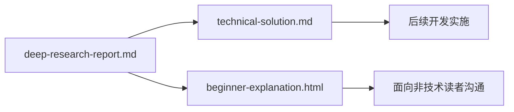

# 变更提案: liquidity-dashboard-docs

## 元信息
```yaml
类型: 文档交付
方案类型: implementation
优先级: P0
状态: 执行中
创建: 2026-05-16
```

---

## 1. 需求

### 背景
项目根目录已有调研报告 `deep-research-report.md`，主题是面向个人交易者与开发者的流动性与行情周期信号面板。用户要求基于该报告生成两类交付物：一份技术方案 Markdown，以及一份适合非技术读者理解的 HTML 页面。

### 目标
- 生成 `technical-solution.md`，用于向开发者说明系统目标、架构、数据源、指标、存储、接口、实现阶段、验证与风险。
- 生成 `beginner-explanation.html`，用于用通俗语言解释“为什么做这个面板、它看什么、怎么判断市场状态、如何分阶段落地”。
- 两份文件均只基于调研报告内容整理，不引入未验证的新事实。

### 约束条件
```yaml
时间约束: 当前回合内完成
性能约束: HTML 为静态文件，可直接用浏览器打开
兼容性约束: 不依赖构建工具、后端服务或外部 CDN
业务约束: 不包含交易执行、私钥管理、实盘下单能力
```

### 验收标准
- [ ] `technical-solution.md` 存在且覆盖系统范围、架构、数据源、数据模型、评分逻辑、API、部署、验证和风险。
- [ ] `beginner-explanation.html` 存在且可作为静态页面打开，结构清晰，适合小白理解。
- [ ] 两份产物与调研报告核心结论一致，没有模板占位符。
- [ ] 不修改原调研报告。

---

## 2. 方案

### 技术方案
采用“一份工程技术方案 + 一份通俗解释页面”的双层表达方式：

- 技术方案面向开发实施，按照 MVP 可落地路径组织：目标边界、架构、数据源、采集节奏、表结构、评分算法、接口、前端模块、部署监控、验证计划、实施路线。
- HTML 面向非技术读者，用“市场里的钱在哪里”作为主线，将宏观、一级链上、二级市场三层信号解释成容易理解的判断框架，并用卡片、矩阵和时间线呈现。

### 影响范围
```yaml
涉及模块:
  - 文档交付: 新增技术方案与通俗解释页面
预计变更文件: 4
```

### 风险评估
| 风险 | 等级 | 应对 |
|------|------|------|
| 调研报告中部分外部引用不可在本地复核 | 中 | 产物明确以现有报告为来源，不新增外部断言 |
| 技术方案过度工程化 | 中 | 第一阶段限定为信号面板 MVP，不包含自动交易 |
| 小白页面过于简化导致误解为投资建议 | 中 | 明确说明面板用于观察流动性，不等于买卖建议 |
| 数据源商业条款与限流变化 | 中 | 技术方案保留 provider adapter 与替换策略 |

---

## 3. 技术设计

### 架构设计


### 数据模型
本次不创建运行时数据库，只在技术方案中定义建议表结构与接口契约。

---

## 4. 核心场景

### 场景: 开发者阅读技术方案
**模块**: 文档交付  
**条件**: 已有调研报告  
**行为**: 打开 `technical-solution.md` 查看系统拆解与实施计划  
**结果**: 能据此拆分采集、评分、API、前端和验证任务

### 场景: 非技术读者理解面板价值
**模块**: 文档交付  
**条件**: 已有静态 HTML 页面  
**行为**: 打开 `beginner-explanation.html` 浏览卡片、矩阵和分阶段说明  
**结果**: 能理解面板不是预测器，而是观察资金流向与市场状态的仪表盘

---

## 5. 技术决策

### liquidity-dashboard-docs#D001: 使用静态文档交付第一版
**日期**: 2026-05-16  
**状态**: 已采纳  
**背景**: 用户当前要求是技术方案与小白理解 HTML，而不是实现完整系统。  
**选项分析**:
| 选项 | 优点 | 缺点 |
|------|------|------|
| A: 静态 Markdown + HTML | 交付快、易审阅、无需运行环境 | 暂不具备动态数据能力 |
| B: 直接实现 Dashboard 原型 | 更接近最终产品 | 超出当前要求，且会在需求未完全确认前引入技术决策 |
**决策**: 选择方案 A。  
**理由**: 当前最有价值的是把报告转成可执行技术方案与可沟通说明材料。  
**影响**: 后续开发可直接以 `technical-solution.md` 作为实现蓝图。
