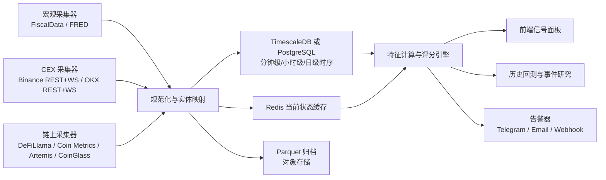
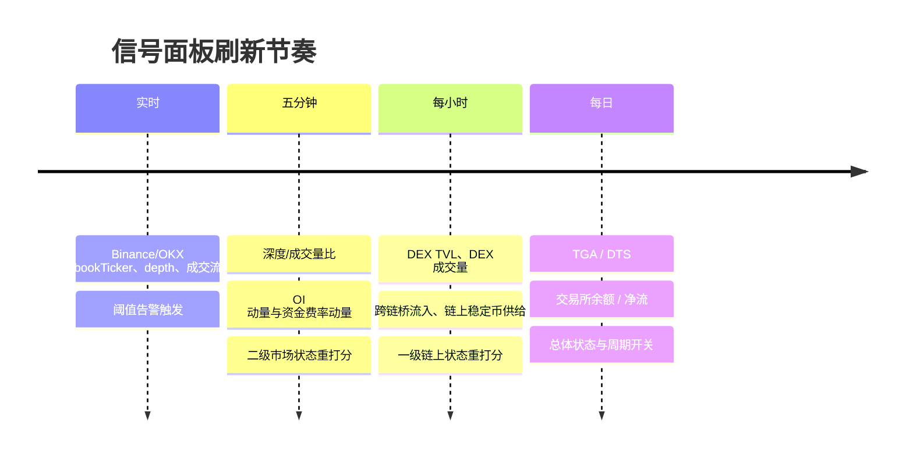

# 面向个人交易者与开发者的流动性与行情周期信号面板方案

## 执行摘要

你的判断是对的：**对个人开发者和交易者来说，把“流动性周期判别”做成一套重型的在线因果分析系统，通常投入产出比不高；更合适的做法，是先做一个可解释、可维护、能持续更新的“分层信号面板”**。开源项目 Day1 Global Briefing 的做法就很典型：它用单一看板聚合美股、加密、情绪、BTC 链上指标和 AI 分析，前端按 5 分钟轮询、后端做 60 秒缓存，并把数据源控制在少量可维护接口内；公开页面也清楚展示了其“总览—情绪—BTC 抄底/逃顶—持仓—新闻”的面板化组织方式。另一方面，@gongyue777 在公开镜像里多次强调“市场的钱都跑到合约去了”“看 OI、看指数才能较早看出一些端倪”，以及用 DexScreener、GMGN、地址库、做市痕迹来判断链上启动，这些都说明：**实战上更重要的是回答“钱现在在哪一层、往哪边流、是否进入可持续扩张”，而不是先做复杂黑箱模型**。citeturn45view0turn46view0turn44view1turn44view0

基于这一点，最适合你的 MVP 不是“全自动预测系统”，而是一个围绕四个问题工作的面板：**宏观流动性在注入还是抽走；二级市场流动性是否支持山寨普涨；一级链上流动性是否支持新标的冲高估值；当前市场属于枯竭、恢复、扩张还是过热。** 这套面板建议拆成三个主分数：**宏观流动性分数、二级市场流动性分数、一级链上流动性分数**，再用一个四状态分类器输出市场状态。这样既能落地，又便于和 agent 结对编程实现。citeturn6search0turn29view0turn33view0turn33view1turn15view1turn27view1

本报告按你最新要求，明确把重点放在**“数据信号面板”**，而不是交易执行系统。未指定项我统一标注如下：**预算：未指定；支持链：未指定；目标延迟：未指定**。在未指定前提下，我建议的默认目标是：**二级市场面板 5 分钟级刷新，链上聚合指标 1 小时级刷新，宏观指标日频为主**。这已经足够覆盖 TGA、交易所余额、链上交易量、DEX TVL、CEX 深度/成交量、资金费率、OI 等判断周期最关键的信号。

## 面板应回答的问题与关键用例

如果目标是辅助判断“流动性”和“行情周期”，而不是做高频交易，那么面板应该优先服务于以下几类判断。

第一类，是**“广谱风险偏好是否打开”**。也就是：当前环境是否支持山寨普涨，而不是只支持 BTC、少数龙头、或者纯合约 squeeze。这里核心是把**二级市场**单独拿出来看：CEX 深度、现货成交量、合约 OI、资金费率、合约/现货量比、交易所余额变化，能较直接地反映“交易资金是否足够支撑广泛风险偏好扩散”；Binance 和 OKX 都提供了深度、成交、OI、资金费率等官方公开接口或频道，适合做这个层面的快频观察。citeturn14view0turn15view0turn15view1turn16view0turn26view3turn27view1turn24view0

第二类，是**“一级链上是否有承接能力”**。这不是看一个币有没有故事，而是看某条链、某一类资产、某一类 launch 是否有真实流动性承接。DeFiLlama 把 TVL、DEX/Perp volume、bridges、stablecoins 等指标拆成了独立维度；Coin Metrics、Artemis 这类链上/稳定币分析提供商则覆盖活跃地址、链上活动、稳定币供给/转账等聚合指标。对“一级能否支持高估值”来说，真正重要的不是某个代币叙事，而是**链级稳定币供给、桥流入、DEX TVL 与 DEX Volume/TVL、链上活跃度是否同步扩张**。citeturn33view0turn33view1turn30view1turn32search0turn34search0turn34search7turn12search4

第三类，是**“宏观抽水还是放水”**。如果你把 TGA、稳定币总供给、交易所净流入/净流出、链上活跃度放在同一屏里看，会更容易理解为什么有时“表面上涨、但承载面很差”。美国财政部 FiscalData 的 Daily Treasury Statement 提供日频 Treasury cash balance 数据集；FRED 提供便于调用的 TGA 相关序列和 API。实践上建议把**TGA 净流入**定义为 TGA 余额的日变动，把**流动性脉冲**定义为它的相反数：TGA 上升通常意味着对系统流动性的抽离，TGA 回落通常更偏向释放流动性。FiscalData 可用于更原始的日频口径，FRED 的 WDTGAL/WTREGEN 更适合快捷接入和历史研究。citeturn6search0turn6search1turn29view0turn29view1turn8search0turn8search6turn38view0

第四类，是**“钱在一级还是二级”**。这是你最新问题里最关键的落点。公开镜像里的 @gongyue777 反复提到“整个市场的钱都跑到合约去了”，并把 OI、指数、做市痕迹、地址建仓当成前置信号。这一点非常值得借鉴：**面板必须能直接看出流动性目前偏向合约二级，还是向链上新叙事扩散。** 因此，我建议把最终判断做成一个二轴矩阵：横轴是**一级链上流动性得分**，纵轴是**二级市场流动性得分**。这比单看“总流动性”更有可操作性。citeturn44view1turn44view0

在功能上，这个面板最少要支持五件事：

| 用例 | 你想回答的问题 | 需要的输出 |
|---|---|---|
| 当前市场体感校准 | 现在到底是冷、暖、热、过热？ | 四状态标签 + 三大分数 |
| 山寨普涨判别 | 是否支持普涨，而不只是 squeeze？ | 二级市场流动性分数 + breadth 提示 |
| 一级高估值承接判别 | 是否支持一级项目打到高 FDV/估值？ | 一级链上流动性分数 + 链级承接标签 |
| 资金去向判断 | 钱在去链上、去现货、还是去合约？ | 一级/二级分数对比 + 迁移提示 |
| 风险预警 | 是否已经过热、情绪拥挤、深度变差？ | 异常告警 + 状态切换时间戳 |

其中，“**支持山寨普涨**”与“**支持一级 1B 估值**”不应被当作同一个问题。前者更依赖**二级市场广度与换手能力**，后者更依赖**链级承接、稳定币存量、桥流入和 DEX 深度**。很多时候，这两者会分化。

## 指标体系与周期判别框架

这套面板的关键，不是把所有能拿到的指标都堆上去，而是按“快、慢、结构”三层组织。

“慢层”是宏观与总量层，决定市场有没有大水。这一层建议最少包括：

| 层级 | 指标 | 关键字段 | 采样频率 | 观察窗口 | 优先级 |
|---|---|---|---|---|---|
| 宏观 | TGA 余额与净流入 | `tga_close_usd`, `delta_1d`, `delta_5d`, `z_60d` | 日频 | 20/60/120 日 | P0 |
| 宏观 | 稳定币总供给 | `stablecoin_supply_usd`, `growth_7d`, `growth_30d` | 日频 | 7/30/90 日 | P1 |
| 宏观 | 交易所总余额/净流 | `exchange_supply_usd`, `netflow_usd` | 日频 | 7/30/90 日 | P1 |

“结构层”是一级链上生态是否真正活跃。这一层建议最少包括：

| 层级 | 指标 | 关键字段 | 采样频率 | 观察窗口 | 优先级 |
|---|---|---|---|---|---|
| 一级链上 | 链上日交易量 | `tx_volume_usd` | 日频或小时聚合 | 7/30/90 日 | P0 |
| 一级链上 | 活跃地址 | `active_addresses` | 日频 | 7/30/90 日 | P0 |
| 一级链上 | DEX TVL | `dex_tvl_usd`, `pct_change_7d` | 日频/小时 | 7/30/90 日 | P0 |
| 一级链上 | DEX 成交量 | `dex_volume_usd` | 日频/小时 | 7/30/90 日 | P0 |
| 一级链上 | DEX Volume / TVL | `dex_volume_usd / dex_tvl_usd` | 日频/小时 | 7/30/90 日 | P0 |
| 一级链上 | 跨链桥流入 | `bridge_inflow_usd`, `net_bridge_flow_usd` | 日频/小时 | 7/30/90 日 | P1 |
| 一级链上 | 链上稳定币供给 | `stablecoin_supply_chain_usd` | 日频 | 7/30/90 日 | P1 |

“快层”是二级市场交易型流动性。这一层建议最少包括：

| 层级 | 指标 | 关键字段 | 采样频率 | 观察窗口 | 优先级 |
|---|---|---|---|---|---|
| 二级市场 | 订单簿深度 | `depth_10bps_usd`, `depth_50bps_usd`, `depth_100bps_usd` | 10 秒到 1 分钟 | 日内/7 日 | P0 |
| 二级市场 | spread 与 bookTicker | `best_bid`, `best_ask`, `spread_bps` | 实时/秒级 | 日内 | P1 |
| 二级市场 | 现货成交量 | `spot_volume_usd` | 1 分钟到 1 小时 | 1/7/30 日 | P0 |
| 二级市场 | 深度/成交量比 | `depth_50bps_usd / spot_volume_24h_usd` | 5 分钟/1 小时 | 7/30 日 | P0 |
| 二级市场 | 资金费率 | `funding_rate`, `realized_rate`, `pct_rank` | 1 小时/8 小时 | 7/30/90 日 | P0 |
| 二级市场 | OI 与 OI 动量 | `oi_usd`, `oi_mom_1d`, `oi_mom_7d` | 5 分钟/1 小时 | 7/30/90 日 | P0 |
| 二级市场 | 合约/现货量比 | `perp_volume / spot_volume` | 1 小时/日频 | 7/30 日 | P1 |

这些指标中，**活跃地址**在 Coin Metrics 的定义是“在一个窗口内参与 ledger change 的唯一地址数”；**交易所供给**定义为“某交易所在区间末持有的数量”；**DeFiLlama**则把 TVL、DEX/Perp volume、bridges、stablecoins 分成了可独立调用的模块化指标。因此，数据建模时最好不要把它们混成一个“大而全的总量表”，而是保留“链、协议、交易所、交易对、时间粒度”的原始实体维度。citeturn30view1turn32search5turn33view0turn33view1turn32search0

一个实用的判别框架是：

- **宏观流动性分数**：主要由 `-ΔTGA`、稳定币供给增速、交易所净流/净供给变化组成。
- **一级链上流动性分数**：主要由活跃地址增速、链上交易量增速、DEX TVL 增速、DEX Volume/TVL、桥净流入组成。
- **二级市场流动性分数**：主要由深度/成交量比、现货成交量扩张、OI 动量、资金费率位置、合约/现货量比组成。

最重要的一条设计原则是：**把“绝对值判断”改成“滚动分位数判断”**。例如，资金费率本身高低的意义会变化，OI 水平也受市场体量扩张影响，所以更适合用 **30 日、90 日、252 日滚动分位数**标记“冷—暖—热—拥挤”。

## 数据源与 API 选型

对个人开发者而言，最优策略通常不是“全部自建全节点 + 全部自己标注地址”，而是**公开一手源 + 少量高性价比聚合商**。如果只做信号面板，不做撮合执行，那么以下组合通常足够。

| 数据域 | 推荐数据源 | 示例端点或频道 | 授权方式 | 官方速率/限制 | 适合的延迟层级 | 费用与备注 |
|---|---|---|---|---|---|---|
| TGA 与美国财政现金 | U.S. Treasury FiscalData + FRED | FiscalData Daily Treasury Statement；FRED `fred/series/observations?series_id=WDTGAL` | FiscalData 为公开 REST；FRED 需注册 API key | FRED 文档要求注册 API key；FiscalData 为公开 REST 文档。官方公开页面未突出单独的数值限速。 | 日频 | 免费；DTS 为日频原始口径，FRED 便于研究与回测。citeturn6search0turn6search1turn29view0turn29view1turn8search0turn8search6 |
| Binance 现货深度与成交 | Binance 中文官方文档 | `GET /api/v3/depth`，`GET /api/v3/klines`，`<symbol>@bookTicker`，`<symbol>@depth@100ms` | 公开行情接口 | 现货 depth 权重随 limit 为 5/25/50/250；WS 每连接最长 24 小时、每秒最多 5 个消息、每 IP 5 分钟最多 300 次连接请求 | 实时到 5 分钟 | 免费；适合做二级市场快层。citeturn14view0turn17view0turn18view2 |
| Binance 合约 OI / 资金费率 / 深度 | Binance 中文官方文档 | `GET /fapi/v1/openInterest`，`GET /fapi/v1/fundingRate`，`GET /fapi/v1/depth` | 公开行情接口 | OI 权重 1；资金费率与 `fundingInfo` 共享 `500/5min/IP`；futures depth 权重依 limit 为 2/5/10/20 | 实时到 5 分钟 | 免费；深度返回 `E` 与 `T`，可估算采集链路延迟。citeturn15view0turn15view1turn16view0 |
| OKX 现货/合约深度、OI、资金费率 | OKX 官方文档 | `GET /api/v5/market/books`，`GET /api/v5/public/open-interest`，`GET /api/v5/public/funding-rate-history`，WS `books`/`books-l2-tbt` | 公共频道无需登录；私有请求需 `OK-ACCESS-*` 头 | REST order book `40 req / 2s`，open interest `20 req / 2s`，funding history `10 req / 2s`；`books` 100ms，`books-l2-tbt`/`books50-l2-tbt` 10ms，后两者需登录且对 VIP 级别有限制 | 实时到 5 分钟 | 免费；适合作为 Binance 之外的第二家官方基准。citeturn21search0turn24view0turn26view3turn27view0turn27view1 |
| DeFi 总量、DEX 量能、桥与稳定币 | DeFiLlama 官方 API | `/v2/historicalChainTvl/{chain}`，`/overview/dexs`，`/summary/dexs/{protocol}`，`/stablecoincharts/{chain}`，Pro: `/bridges/*` | Free 无鉴权；Pro API key | Free API 与 Pro API 分离；Pro 为 `$300/mo`，可走更高限速；Free 无鉴权 | 小时到日频 | 做一级链上面板非常高效；更适合“总量/生态层”而非撮合级微结构。citeturn33view0turn33view1 |
| 链上活跃地址、交易所供给/净流、市场与链上资产指标 | Coin Metrics | Community API 根 `https://community-api.coinmetrics.io/v4`，`/timeseries/asset-metrics`，`/timeseries/exchange-metrics` | Community 无 API key；付费版有 API key | 官方文档说明 community 与 paid 版并发上限均为 10 个并行 REST 请求，超出后排队，并通过 `429` 与 `X-RateLimit-*` 头提示 | 日频到小时级 | Community 免费，付费版增强覆盖与速率；非常适合交易所余额、链上活跃度、资产/交易所级指标。citeturn41search7turn41search0turn32search0turn32search5turn32search9turn30view1 |
| 个人开发者一站式聚合替代 | CoinGlass 中文官方文档 | `CG-API-KEY` 认证；如 `/api/futures/open-interest/history`、资金费率、订单簿、交易所余额、WS `wss://open-ws.coinglass.com/ws-api?...` | 所有请求都需 API key | 频率限制按订阅套餐不同而不同，429 为超频；WS 需 `cg-api-key` 查询参数 | 实时到日频 | 适合个人快速做出面板；官方中文资料齐全，且覆盖 OI、资金费率、订单簿、交易所余额、宏观/周期类指标。citeturn43search2turn43search1turn43search4turn42view1turn43search16 |
| 稳定币供给、稳定币 DAU/转账量 | Artemis 官方 API / 文档 | `STABLECOIN_SUPPLY`、`P2P_STABLECOIN_TRANSFER_VOLUME`、`Fetch Stablecoin DAU` | 文档为官方；具体 key 依产品权限 | 文档以日频数据为主 | 日频 | 适合作为“链上美元底座”补充层。citeturn12search4turn34search1turn34search4turn34search7 |

如果你只想做一个**个人面板 MVP**，我建议第一阶段采用下面这个组合：

- **宏观**：FiscalData + FRED  
- **二级快层**：Binance + OKX 官方公开接口  
- **一级慢层**：DeFiLlama + Coin Metrics Community  
- **快速交付备选**：如果不想自己拼接太多链上与交易所余额逻辑，就加一个 CoinGlass  

这样做的原因很简单。Day1 这个开源项目本身就是用 **Yahoo Finance + OKX + alternative.me + CoinGlass + Finnhub** 这样克制的数据源组合做成的，它说明对单人项目来说，**少而稳的数据源集合**比“接一切接口”更可持续。citeturn45view0

## 数据管道与存储架构

如果目标只是做“信号面板”，那么我不建议一上来就做 Kafka、Flink、ClickHouse 全家桶。**个人开发者最实用的架构，是“采集器 + 规范化层 + 时序库 + 当前状态缓存 + 前端面板”**。Day1 的启发在于：前端 5 分钟轮询、后端聚合 API、短缓存，可以用很低复杂度把多源数据整合成一个可用产品。你的面板需要比它再往前走一步：把快数据和慢数据拆层。citeturn45view0

推荐的最小架构如下：



建议的刷新节奏可以直接做成分层：



存储上，不建议一张表混装所有指标。更推荐三层表：

| 存储层 | 建议技术 | 保存内容 | 建议保留期 |
|---|---|---|---|
| 热层 | Redis | 当前最新值、最近告警、面板卡片缓存 | 1–7 天 |
| 温层 | PostgreSQL + Timescale | 1m/5m/1h/1d 特征与得分 | 1–2 年 |
| 冷层 | Parquet + 对象存储 | 原始快照与长历史回测数据 | 全量归档 |

目标延迟未指定时，我建议默认 SLA 为：

- **二级市场信号**：5 分钟内可见
- **一级链上信号**：1 小时内更新
- **宏观信号**：日频即可
- **状态分类**：每 5 分钟重算快层，每小时重算总分

容错方面，至少做三件事。第一，**WebSocket 断线重连**。Binance 明确写了单连接最长不超过 24 小时，并有 ping/pong 与连接频率限制；OKX 也明确建议对长时间无推送做 ping/pong 保活。第二，**REST 回补**。当 WS 中断时，用 REST snapshot 回补缺口。第三，**时间戳双写**：记录 `exchange_ts`、`ingest_ts`、`compute_ts`，这样才能分析数据新鲜度。Binance futures 深度接口直接返回消息时间 `E` 和撮合引擎时间 `T`，OKX order book 返回 `ts`，都足以让你做“数据新鲜度/链路滞后”监控。citeturn17view0turn7search0turn21search0turn15view0turn26view3

如果你想进一步收敛复杂度，可以按下面的原则裁剪：

- 不做逐笔成交入库，只保存聚合后的 1 分钟特征。
- 不做所有链，只先做你最关心的 3–5 条链。
- 第一期不做桥全量交易，只消费聚合桥流入数据。
- 第一期不做复杂钱包标签，自身不构建交易所地址聚类，把这部分交给 Coin Metrics / CoinGlass 一类外部提供商。

## 指标计算、状态分类与示例 SQL

先明确一点：**实时在线因果推断不是 MVP 必需品**。更实用的做法是：在线只做可解释的分数与状态；离线再做 lead-lag、事件研究、显著性检验。这样，你的面板在工程上更轻，在认知上也更清晰。

### 关键指标定义

建议把几个最核心指标定义得非常朴素：

- **TGA 净流入** = `TGA_t - TGA_(t-1)`  
  - 对市场流动性判断时，使用其相反数 **LiquidityImpulseFromTGA = -(TGA_t - TGA_(t-1))**
- **链上日交易量动量** = `ln(tx_volume_usd_t / MA_30(tx_volume_usd))`
- **DEX TVL 变动率** = `(tvl_t / tvl_(t-7)) - 1`
- **DEX 量效比** = `dex_volume_usd / dex_tvl_usd`
- **CEX 深度/成交量比** = `depth_50bps_usd / spot_volume_24h_usd`
- **资金费率动量** = `funding_rate_t - MA_k(funding_rate)`，其中 `k` 取最近 5–10 个 funding interval
- **OI 动量** = `(oi_usd_t / oi_usd_(t-1d)) - 1`
- **桥迁移强度** = `bridge_inflow_chain_usd / stablecoin_supply_chain_usd`

这里面，活跃地址与交易所供给的底层定义建议沿用 provider 原定义：Coin Metrics 将活跃地址定义为“在给定窗口内参与 ledger change 的唯一地址数”，将交易所供给定义为“某交易所在区间末持有的数量”；OKX 公开 funding history 时还特别说明，某些 alt 合约 funding interval 可能从默认的 8 小时调整为 6/4/2/1 小时，所以资金费率动量不要死假设成固定 8 小时步长，而要按 `fundingTime` 实际间隔计算。citeturn30view1turn32search5turn27view1

### 示例 SQL

下面的 SQL 假设你有如下几张规范化表：

- `macro_tga_daily(dt, tga_close_usd)`
- `chain_daily(dt, chain, active_addresses, tx_volume_usd, stablecoin_supply_usd, bridge_inflow_usd)`
- `dex_chain_daily(dt, chain, dex_tvl_usd, dex_volume_usd)`
- `cex_depth_5m(ts, venue, symbol, depth_50bps_usd, spot_volume_24h_usd)`
- `perp_1h(ts, venue, symbol, funding_rate, oi_usd)`

**TGA 净流入与流动性脉冲**

```sql
SELECT
  dt,
  tga_close_usd,
  tga_close_usd - LAG(tga_close_usd) OVER (ORDER BY dt) AS tga_net_inflow_usd,
  -(tga_close_usd - LAG(tga_close_usd) OVER (ORDER BY dt)) AS liquidity_impulse_from_tga
FROM macro_tga_daily
ORDER BY dt DESC;
```

**链上日交易量与活跃地址动量**

```sql
SELECT
  dt,
  chain,
  tx_volume_usd,
  active_addresses,
  tx_volume_usd / NULLIF(AVG(tx_volume_usd) OVER (
    PARTITION BY chain ORDER BY dt
    ROWS BETWEEN 29 PRECEDING AND CURRENT ROW
  ), 0) AS tx_volume_vs_30d_ma,
  active_addresses / NULLIF(AVG(active_addresses) OVER (
    PARTITION BY chain ORDER BY dt
    ROWS BETWEEN 29 PRECEDING AND CURRENT ROW
  ), 0) AS active_addr_vs_30d_ma
FROM chain_daily;
```

**DEX TVL 变动率与 DEX 量效比**

```sql
SELECT
  dt,
  chain,
  dex_tvl_usd,
  dex_volume_usd,
  dex_volume_usd / NULLIF(dex_tvl_usd, 0) AS dex_volume_tvl_ratio,
  dex_tvl_usd / NULLIF(
    LAG(dex_tvl_usd, 7) OVER (PARTITION BY chain ORDER BY dt), 0
  ) - 1 AS tvl_change_7d
FROM dex_chain_daily;
```

**CEX 深度/成交量比**

```sql
SELECT
  date_trunc('day', ts) AS dt,
  venue,
  symbol,
  AVG(depth_50bps_usd) AS avg_depth_50bps_usd,
  AVG(spot_volume_24h_usd) AS avg_spot_volume_24h_usd,
  AVG(depth_50bps_usd) / NULLIF(AVG(spot_volume_24h_usd), 0) AS depth_volume_ratio
FROM cex_depth_5m
GROUP BY 1, 2, 3;
```

**资金费率动量与 OI 动量**

```sql
WITH base AS (
  SELECT
    ts,
    venue,
    symbol,
    funding_rate,
    oi_usd,
    AVG(funding_rate) OVER (
      PARTITION BY venue, symbol
      ORDER BY ts
      ROWS BETWEEN 9 PRECEDING AND CURRENT ROW
    ) AS funding_ma_10,
    LAG(oi_usd, 24) OVER (
      PARTITION BY venue, symbol
      ORDER BY ts
    ) AS oi_usd_24h_ago
  FROM perp_1h
)
SELECT
  ts,
  venue,
  symbol,
  funding_rate,
  funding_rate - funding_ma_10 AS funding_momentum,
  oi_usd,
  oi_usd / NULLIF(oi_usd_24h_ago, 0) - 1 AS oi_momentum_24h
FROM base;
```

### 示例伪代码

```python
def score_macro(tga_impulse_z, stablecoin_growth_z, exchange_netflow_z):
    return clip(
        50
        + 0.45 * tga_impulse_z
        + 0.35 * stablecoin_growth_z
        - 0.20 * exchange_netflow_z,
        0, 100
    )

def score_primary(active_addr_z, tx_volume_z, dex_tvl_z, dex_vol_tvl_z, bridge_flow_z):
    return clip(
        0.25 * active_addr_z +
        0.20 * tx_volume_z +
        0.25 * dex_tvl_z +
        0.15 * dex_vol_tvl_z +
        0.15 * bridge_flow_z
    ) * 10 + 50

def score_secondary(depth_volume_ratio_z, spot_volume_z, oi_mom_z, funding_pct, perp_spot_ratio_z):
    crowd_penalty = 0
    if funding_pct > 95:
        crowd_penalty = 10
    return clip(
        50
        + 0.30 * depth_volume_ratio_z
        + 0.20 * spot_volume_z
        + 0.25 * oi_mom_z
        + 0.15 * perp_spot_ratio_z
        - crowd_penalty,
        0, 100
    )

def classify_state(macro, primary, secondary):
    overall = 0.3 * macro + 0.35 * primary + 0.35 * secondary
    if overall < 35:
        return "流动性枯竭"
    elif overall < 55:
        return "流动性恢复"
    elif overall < 75:
        return "流动性扩张"
    else:
        return "流动性过热"
```

### 多层次市场状态分类

我建议把最终状态分成四类，但要同时输出**一级**和**二级**两个子状态。这样你看一眼就知道“哪里热、哪里冷”。

| 状态 | 宏观分数 | 一级链上分数 | 二级市场分数 | 解释 |
|---|---:|---:|---:|---|
| 流动性枯竭 | 低 | 低 | 低 | 资金存量与换手都不足，不支持普涨，也不支持一级高估值承接 |
| 流动性恢复 | 回升 | 低到中 | 中 | 更像修复期，适合看结构性轮动，不适合把局部上涨误判为全面扩张 |
| 流动性扩张 | 中到高 | 高 | 高 | 同时支持链上扩张与二级换手，最接近“山寨可普涨、一级也能承接高估值” |
| 流动性过热 | 高 | 分化 | 极高 | 通常二级先拥挤，存在 squeeze 和情绪溢价，但持续性下降，容易转入分化 |

更关键的是下面这个二维判断表：

| 一级链上 | 二级市场 | 解释 | 对山寨普涨 | 对一级 1B 估值 |
|---|---|---|---|---|
| 低 | 高 | 合约主导、短线拥挤、链上承接弱 | 中低 | 低 |
| 高 | 低 | 链上累积开始，但二级风险偏好还未全面打开 | 中 | 中高 |
| 高 | 高 | 健康扩张，最像“全面风险偏好打开” | 高 | 高 |
| 低 | 低 | 冷市 / 退潮 | 低 | 低 |

这张表实际上正对应了你提到的那个核心问题：**市场是否只支持“二级合约行情”，还是已经有足够链上承接去支持一级高估值发行与二级广谱扩散。**

## Agent 结对编程任务与验证方法

如果你要直接和 agent 结对编程，我建议不要按“技术栈模块”拆，而要按“能否形成面板闭环”拆。下面这个任务清单更适合实际推进。

| 优先级 | 任务 | 输入 | 输出 | 验收标准 |
|---|---|---|---|---|
| P0 | 统一实体字典 | 交易所、链、symbol 命名规则 | `venues.yaml`、`chains.yaml`、`symbols_map.yaml` | Binance/OKX/DeFiLlama/Coin Metrics 的同一资产能映射到统一主键 |
| P0 | 宏观采集器 | FiscalData/FRED | `macro_tga_daily` | 可稳定拉取 TGA 日频历史，支持增量更新 |
| P0 | CEX 快层采集器 | Binance/OKX depth、OI、funding、volume | `cex_depth_5m`、`perp_1h` | 断线可恢复，5 分钟内可生成二级分数 |
| P0 | 一级链上采集器 | DeFiLlama、Coin Metrics、Artemis | `chain_daily`、`dex_chain_daily` | 至少能覆盖活跃地址、链上交易量、DEX TVL、DEX volume、稳定币供给 |
| P0 | 特征与评分引擎 | 规范化表 | `scores_hourly`、`state_current` | 三大分数与四状态能按计划刷新 |
| P0 | 前端看板 | `state_current` 与历史表 | Dashboard 页面 | 首页可一眼看出 Macro/Primary/Secondary/Overall |
| P1 | 告警系统 | 状态切换、阈值 crossing | Telegram/Email/Webhook 告警 | 告警去重、冷却时间、恢复通知可用 |
| P1 | 历史回测工具 | 历史特征与价格/returns | Notebook / 回测报告 | 能跑出状态切换前后 1d/7d/30d 统计 |
| P2 | 替代聚合数据接入 | CoinGlass / 付费源 | 简化版 provider adapter | 不改业务逻辑即可切换 source adapter |

对每一项任务，我建议都坚持一个简单验收原则：**先能稳定生产一个可解释的数字，再去追求模型复杂度**。比如 P0 的 `scores_hourly` 哪怕只是线性加权，只要状态切换能和你主观体感基本一致，就已经有很高价值。

### 验证与回测建议

验证不要一上来就做收益最大化，而应该先做三层验证。

第一层是**一致性验证**。比如，当 TGA 流动性脉冲转强、链上稳定币供给扩张、DEX TVL 和活跃地址同步上行时，一级分数是否也同步回升；当 CEX 深度/成交量比恶化、OI 飙升且资金费率进入极端分位时，二级是否进入过热。这个层面主要是验证面板有没有“逻辑顺序错误”。

第二层是**事件研究**。例如：

- TGA 5 日累计回落事件前后，BTC/ETH/中小盘表现如何；
- 某条链桥净流入进入 90 分位后，7 日内该链 DEX volume、链上活跃地址、链上新币表现如何；
- 二级市场 OI 与资金费率共振过热后，未来 3 日是否更容易出现回撤或分化。

第三层是**样本外稳健性**。这里可以利用 FRED/ALFRED 的 real-time period 机制，避免宏观数据修订带来的回看偏差；也可以直接使用 Binance、OKX、DeFiLlama 的历史接口做滚动样本切片。FRED 官方明确说明 `realtime_start` 和 `realtime_end` 可以用于取“某个历史时点当时能看到的数据”，而 DeFiLlama 也提供历史 chain TVL 与 DEX summary 类接口，非常适合做样本外验证。citeturn4search16turn29view0turn33view0turn27view1turn16view0

一个非常重要的工程建议是：**不要把 lead-lag、Granger、显著性检验放到在线打分链路里**。它们应该是离线研究 job，每周或每月更新一次，用于校准阈值和权重，而不是作为实时面板必需步骤。

## 部署、监控、安全合规与参考链接借鉴

### 部署与成本建议

预算未指定时，我建议按三档思路规划：

| 档位 | 数据方案 | 预计月成本 | 适用阶段 |
|---|---|---:|---|
| 极简版 | FRED/FiscalData + Binance + OKX + DeFiLlama Free + Coin Metrics Community | 云资源为主，通常几十到一百多美元 | MVP |
| 轻付费版 | 极简版 + CoinGlass | 在极简版基础上再加数据订阅；CoinGlass 官方材料写到入门价可低至约 `$35/mo` | 更快交付 |
| 强化版 | 轻付费版 + DeFiLlama Pro + 付费链上数据 | DeFiLlama Pro 为 `$300/mo`，再叠加其他数据与云资源 | 研究与多链扩张 |

DeFiLlama 官方文档明确写了 Pro API 为 `$300/mo`；CoinGlass 官方学习中心材料则写到 API 价格可低至约 `$35/mo`。而 Day1 的开源 README 也展示了一个现实世界的单人 dashboard 成本结构：市场数据大量用免费接口，按需购买 CoinGlass、Claude、OpenAI 等服务。citeturn33view0turn36search0turn45view0

部署上，Day1 的做法很有参考价值：Next.js 前端、聚合 API、Redis、Vercel Cron。借鉴它的思想，但对于你的面板，我建议前后端稍微分离：

- **前端**：Next.js / React，专门做卡片、热力图、状态灯
- **后端 API**：FastAPI 或 Node API，专门从 Redis / Postgres 读面板结果
- **采集器**：独立 Python worker
- **定时任务**：Cron / GitHub Actions / 轻量调度器
- **归档**：Parquet + 对象存储

这样做的好处是：后面如果你把面板接给多个 agent 或将来加上执行系统，采集层和展示层不用重写。

### 监控与运维建议

运维层面，建议监控六个指标，而不是只监控“程序有没有挂”：

1. **数据新鲜度**：每个源最近更新时间距现在多久  
2. **缺失率**：最近 1 小时/1 天空值比例  
3. **断线率**：WS 重连次数与单次中断时长  
4. **漂移率**：同一指标不同源偏差是否突然拉大  
5. **状态翻转频率**：状态切换若过于频繁，说明阈值太敏感  
6. **告警噪音比**：告警后若大多无用，说明阈值或冷却策略需要重调  

备份方面，至少保留：

- 每日原始快照
- 每次状态切换记录
- 每次告警触发上下文
- 每周评分参数版本

因为你的目标是“辅助判断周期”，所以**解释链**非常重要。任何一次状态切换，都最好能回溯到“哪些指标抬升/压低了分数”。

### 安全与合规注意事项

因为你现在只需要“信号面板”，最重要的安全建议其实非常简单：**第一版不要接交易权限，不要接链上私钥，不要做热钱包执行。** 一旦把范围限定在“只读数据面板”，你的主风险就从“资金安全”下降为“API key 与数据可用性”。

即便如此，也有几条必须遵守：

- 交易所 API key 若确实需要，也尽量只开 **Read-only** 权限  
- 绑定 IP 白名单  
- 前端绝不直接暴露 key  
- 采集器、前端、数据库、告警机器人使用不同密钥与环境变量空间  
- 对外只暴露已经聚合后的结果，不直接再分发原始供应商数据  

OKX 官方文档明确建议将 API key 绑定 IP，并指出未绑定 IP 且具有 trade/withdraw 权限的 key 会在 14 天无活动后过期；私有 REST 请求需携带 `OK-ACCESS-KEY`、`OK-ACCESS-SIGN`、`OK-ACCESS-TIMESTAMP`、`OK-ACCESS-PASSPHRASE` 等头。Binance 的 API 文档也明确区分了需要签名的请求与公共行情接口。对于只做面板的人，这些都应成为你**不接交易权限**的理由，而不是研究如何更快地下单。citeturn21search0turn7search0

合规层面，需要注意三点：

- 某些供应商允许你内部使用，但**不一定允许你公开再分发原始数据**
- 某些交易所/数据商对商业用途、缓存时长、再展示有条款限制
- 如果以后把面板扩展成“自动交易建议”或“代客策略工具”，合规边界会明显上升

### 对用户提供链接的分析与可借鉴点

**关于 `brief.day1global.xyz`**  
这个项目最值得借鉴的，不是它提供了多少指标，而是它把“多源市场信息”收敛成了**固定面板结构**。其 GitHub README 明确写到：前端用 Next.js + SWR，每 5 分钟轮询；后端聚合多个数据源并做 60 秒缓存；数据源包括 Yahoo Finance、OKX、Fear & Greed、CoinGlass、Finnhub；看板页签包括总览、情绪、BTC 抄底/逃顶、持仓、新闻。对你来说，可直接借鉴的点有四个：**克制的数据源组合、固定的仪表盘结构、短缓存减压、把复杂分析结果收敛成少数可视化卡片**。citeturn45view0turn46view0

**关于 `x.com/gongyue777`**  
这次直接抓取 X 页面正文没有返回可读内容，因此下面总结基于公开镜像服务对其公开内容的索引。可见内容有两个非常明确的特征。其一，强调**流动性会在“链上—现货—合约”之间迁移**，并特别提到“钱都跑到合约去了”“看 OI、看指数才能更早抓到端倪”；其二，在更偏链上的场景里，强调**大钱包/地址库、建仓痕迹、做市配合、启动前刷单/成交行为**。这对你的面板设计非常重要：不要试图把所有信息压成一个黑箱总分，而应该显式展示**资金去哪一层、谁在驱动、是否已有做市/承接**。如果你后续要继续扩展一级市场模块，这套“地址流—做市痕迹—启动判别”的思路很值得做成一个独立卡片。citeturn44view1turn44view0

### 最终建议

如果要一句话总结整份方案，那就是：

**先做一个“一级链上 vs 二级市场 vs 宏观”的三层信号面板，用公开一手源和少量高性价比聚合商把数据打通；把复杂统计检验放到离线，不要放到在线；把所有判断最终收敛成少数可解释的分数、状态和告警。**

这比试图一口气做成“万能预测系统”，更适合个人开发者和交易者，也更符合你现在真正想要的东西。