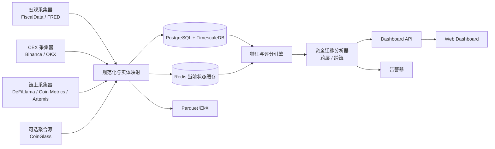

# 流动性与行情周期信号面板技术方案

> 来源: `deep-research-report.md`  
> 版本日期: 2026-05-16  
> 定位: 个人交易者与开发者使用的只读信号面板，不包含交易执行、私钥管理或自动下单。

## 0. MVP 免费实现状态

当前 MVP 已按“不接受付费”的约束落地为本地优先静态应用：

- 运行方式：Node.js 22 + 静态 HTML/CSS/JS。
- 数据文件：`public/data/dashboard.json`。
- 采集命令：`npm run collect`。
- 本地服务：`npm run serve`，默认 `http://localhost:4173/`。
- 免费源：DeFiLlama Free、DeFiLlama Stablecoin Charts、OKX Public REST、GMGN CLI；本地 `sampleSnapshot` 仅作为测试 fixture，不进入生产入分。
- 更新机制：本地服务启动后立即采集一次，并每 4 小时重新生成 `public/data/dashboard.json`，同时向 `public/data/history.json` 追加真实采集快照；前端每 4 小时重新读取 JSON。
- 可解释性：分数卡和 SOL、Base、ETH 主网、BSC 链卡支持鼠标悬浮查看相关原始指标。
- 可视化：页面输出数据有效性卡片、打分原理、链间资金流图、24h / 3天 / 7天链指标趋势曲线。
- 部署默认：本地部署；Vercel 只作为静态页面部署选项；VPS 只作为可选自管服务器方案。

当前实现不使用付费 API，不接交易权限，不接私钥，不需要数据库。

## 1. 目标与边界

本方案把调研报告中的结论落成一个可开发的 MVP 技术方案。系统目标不是预测价格，也不是替用户交易，而是把宏观、二级市场和一级链上三层流动性信号整理成可解释的分数、状态和告警。

面板需要回答四个核心问题：

- 宏观流动性是在注入还是抽走。
- 二级市场流动性是否支持山寨普涨。
- 一级链上流动性是否支持新标的承接高估值，并能分别看到 SOL、Base、ETH 主网、BSC 的承接强弱。
- 游资是在二级市场和一级链上之间迁移，还是在 SOL、Base、ETH 主网、BSC 之间轮动。
- 当前市场处于流动性枯竭、恢复、扩张还是过热。

第一版明确不做：

- 不接交易权限，不保存交易所 trade/withdraw key。
- 不接链上私钥或热钱包。
- 不做在线因果推断、Granger 检验或复杂黑箱模型。
- 不覆盖所有链和所有交易所，先覆盖少量高价值资产、链和场所。

## 2. MVP 成功标准

第一版完成后，用户应能在一个首页中看到：

- `Macro Score`: 宏观流动性分数。
- `Primary On-chain Score`: 一级链上总流动性分数。
- `Primary Chain Scores`: SOL、Base、ETH 主网、BSC 的链级一级流动性分数、排名和变化。
- `Secondary Market Score`: 二级市场流动性分数。
- `Flow Map`: 二级市场和一级链上之间的迁移方向，以及一级各链之间的轮动方向。
- `Overall State`: 四状态标签。
- `Primary vs Secondary Matrix`: 一级链上与二级市场的二维判断。
- `State Change Log`: 最近状态切换的时间、触发指标和解释。
- `Raw Data Tooltip`: 鼠标悬浮分数卡和链卡时显示支撑该分数的原始数据，例如 TVL、DEX 24h、DEX/TVL、稳定币供给、稳定币桥接代理、稳定币供给动量、DEX 交易动量和二级拥挤度；真实桥净流取不到时必须明确标注未入分。
- `Data Validity`: 显示公开源是否成功、失败源数量、数据新鲜度、覆盖率和可信等级。
- `Source Health`: 显示核心源、辅助源、付费受限源和缺口源的本轮状态、影响范围和处理建议。
- `Flow Graph`: 展示 SOL、Base、ETH 主网、BSC 之间的轮动 proxy，箭头粗细表示强弱差。
- `Metric Trends`: 展示四条链的 DEX volume、TVL、稳定币供给在 24h / 3天 / 7天窗口内的真实采集历史曲线；历史不足时只显示已有真实点，不补伪造数据。
- `Hot Money Split`: 分开输出 `tradingHeat` 和 `capitalFlow`，避免把交易量升温误读为真实资金流入。
- `Trade Readiness`: 输出 `not_ready` 或 `watch_only`，说明当前数据能否用于观察或交易辅助；免费 MVP 不输出 `trade_assist`。
- `History Export`: 页面提供 `./data/history.json` 下载入口；`meta.exports.history` 暴露格式、点数和最新时间，便于离线复盘。

默认刷新目标：

| 层级 | 默认刷新 | 用途 |
|---|---:|---|
| 二级市场快层 | 5 分钟 | 深度、成交量、OI、资金费率、合约/现货量比 |
| 一级链上结构层 | 1 小时 | SOL、Base、ETH 主网、BSC 的 DEX TVL、DEX volume、稳定币供给、稳定币桥接代理；真实桥净流当前取不到 |
| 资金迁移层 | 1 小时 | 二级到一级、一级到二级、一级各链之间的迁移倾向 |
| 宏观慢层 | 日频 | TGA、稳定币总供给、交易所余额/净流 |

## 3. 总体架构

推荐采用“采集器 + 规范化层 + 时序库 + 当前状态缓存 + 评分引擎 + 资金迁移分析器 + 前端面板”的轻量架构。



### 3.1 组件职责

| 组件 | 职责 | 第一版建议 |
|---|---|---|
| 采集器 | 拉取各数据源原始数据，处理重试和限流 | Python worker |
| 规范化层 | 统一交易所、链、资产和时间粒度 | YAML 实体字典 + adapter |
| 时序库 | 保存分钟、小时、日级特征 | PostgreSQL + TimescaleDB |
| 当前缓存 | 保存最新状态、卡片数据和告警上下文 | Redis |
| 评分引擎 | 计算三大分数、链级分数、总分和四状态 | Python job |
| 资金迁移分析器 | 判断二级和一级之间、一级各链之间的资金迁移倾向 | Python job |
| API 层 | 向前端提供聚合结果 | FastAPI 或 Node API |
| 前端 | 呈现分数、链级排名、资金流向、矩阵、趋势和解释链 | Next.js / React |
| 告警器 | 状态切换、阈值 crossing 和数据异常通知 | Telegram / Email / Webhook |

## 4. 数据源方案

第一阶段优先使用公开一手源和少量高性价比聚合源。

| 数据域 | 推荐数据源 | 第一版用途 | 优先级 |
|---|---|---|---|
| TGA 与财政现金 | FiscalData / FRED | 宏观流动性脉冲 | P0 |
| Binance 现货与合约 | Binance public REST/WS | 深度、成交量、OI、资金费率 | P0 |
| OKX 现货与合约 | OKX public REST/WS | 第二交易所基准与交叉验证 | P0 |
| DeFi 总量 | DeFiLlama Free | SOL、Base、ETH 主网、BSC 的 DEX TVL、DEX volume、稳定币链级数据 | P0 |
| 稳定币桥接/铸造代理 | DeFiLlama Stablecoin Charts | `totalBridgedToUSD`、`totalMintedUSD`，补充资金流入判断 | P0 |
| 跨链桥与链间流动 | DeFiLlama Bridges / provider bridge data | 链级桥流入、桥流出、净流入；`bridges.llama.fi` 当前探测返回 402，需要付费，作为 P1/付费增强 | P1 |
| 链上活跃与交易所供给 | Coin Metrics Community | 活跃地址、链上交易量、交易所供给；免费 MVP 当前取不到，作为 P1 增强 | P1 |
| 稳定币指标补充 | Artemis | 稳定币 DAU、转账量、供给补充 | P1 |
| 快速聚合替代 | CoinGlass | OI、资金费率、订单簿、交易所余额、链级/交易所交叉验证 | P1 |

### 4.1 数据源接入原则

- 所有 provider 接入必须走 `adapter`，业务层不直接依赖供应商字段名。
- 每条记录保留 `source`、`source_ts`、`ingest_ts`、`compute_ts`。
- 数据源不可用时，评分输出需要标记 `stale` 或 `partial`，不能静默填 0。
- 关键免费源不可用时，对应分项为 `null` 且不合成总分，不能用测试样例或本地 mock 入分。
- 链级一级分数必须保留原始链维度，禁止只汇总成一个 `primary_score`。
- 资金迁移输出是“倾向”和“强度”，不是对真实资金身份的确定追踪；没有地址标签或桥交易明细时，必须标注为 proxy signal。
- 对有 API key 的服务只使用只读权限，前端不暴露 key。

## 5. 实体字典

第一版需要先建立统一主键，避免不同数据源之间资产名、链名和交易对不一致。

建议文件：

- `config/venues.yaml`
- `config/chains.yaml`
- `config/assets.yaml`
- `config/symbols_map.yaml`

示例：

```yaml
venues:
  binance:
    type: cex
    display_name: Binance
  okx:
    type: cex
    display_name: OKX

chains:
  ethereum:
    display_name: ETH 主网
    aliases: [Ethereum, ETH, mainnet]
    first_version: true
  base:
    display_name: Base
    aliases: [Base]
    first_version: true
  solana:
    aliases: [Solana, SOL]
    display_name: SOL
    first_version: true
  bsc:
    display_name: BSC
    aliases: [BNB Chain, Binance Smart Chain, BSC]
    first_version: true

chain_groups:
  first_version_primary:
    chains: [solana, base, ethereum, bsc]

symbols:
  BTC-USDT:
    base: BTC
    quote: USDT
    binance_spot: BTCUSDT
    okx_spot: BTC-USDT
    binance_perp: BTCUSDT
    okx_swap: BTC-USDT-SWAP

ecosystem_baskets:
  solana:
    spot_symbols: [SOL-USDT]
    perp_symbols: [SOL-USDT]
    onchain_chain: solana
  ethereum:
    spot_symbols: [ETH-USDT]
    perp_symbols: [ETH-USDT]
    onchain_chain: ethereum
  bsc:
    spot_symbols: [BNB-USDT]
    perp_symbols: [BNB-USDT]
    onchain_chain: bsc
  base:
    spot_symbols: []
    perp_symbols: []
    onchain_chain: base
    note: Base 无原生交易代币，第一版用链上指标和 Base 生态 token basket 补充。
```

## 6. 数据模型

### 6.1 原始快照表

原始表尽量保留供应商返回值，便于回放和排错。

| 表 | 粒度 | 说明 |
|---|---|---|
| `raw_provider_events` | 原始 | provider 响应、状态码、请求参数、时间戳 |
| `raw_order_book_snapshots` | 快照 | depth 快照，按 venue/symbol 保存 |
| `raw_funding_rates` | funding interval | 资金费率历史 |
| `raw_open_interest` | 5m/1h | OI 快照 |

### 6.2 规范化指标表

| 表 | 关键字段 | 粒度 |
|---|---|---|
| `macro_tga_daily` | `dt`, `tga_close_usd`, `delta_1d`, `delta_5d` | 1d |
| `chain_daily` | `dt`, `chain`, `stablecoin_supply_usd`，P1 可扩展 `active_addresses`, `tx_volume_usd` | 1d |
| `dex_chain_daily` | `dt`, `chain`, `dex_tvl_usd`, `dex_volume_usd` | 1d/1h |
| `bridge_flow_hourly` | `ts`, `chain`, `bridge_inflow_usd`, `bridge_outflow_usd` | 1h/P1，免费 MVP 不写入分 |
| `chain_liquidity_hourly` | `ts`, `chain`, `stablecoin_supply_usd`, `stablecoin_bridge_proxy_usd`, `dex_tvl_usd`, `dex_volume_usd`，P1 可扩展 `bridge_netflow_usd`, `active_addresses`, `tx_volume_usd` | 1h |
| `ecosystem_market_hourly` | `ts`, `chain`, `venue`, `basket`, `spot_volume_usd`, `perp_volume_usd`, `oi_usd`, `funding_rate` | 1h |
| `primary_market_activity_hourly` | `ts`, `chain`, `new_pair_liquidity_usd`, `new_pair_volume_usd`, `launchpad_volume_usd` | 1h/P1 |
| `cex_depth_5m` | `ts`, `venue`, `symbol`, `depth_50bps_usd`, `spot_volume_24h_usd` | 5m |
| `perp_1h` | `ts`, `venue`, `symbol`, `funding_rate`, `oi_usd`, `perp_volume_usd` | 1h |

### 6.3 特征与评分表

| 表 | 关键字段 | 说明 |
|---|---|---|
| `features_hourly` | `ts`, `feature_key`, `entity_key`, `value`, `z_score`, `percentile` | 标准化特征 |
| `primary_chain_scores_hourly` | `ts`, `chain`, `score`, `rank`, `momentum_24h`, `reason_codes`, `data_quality` | SOL、Base、ETH 主网、BSC 的链级一级流动性分数 |
| `liquidity_flow_hourly` | `ts`, `from_layer`, `to_layer`, `from_chain`, `to_chain`, `flow_score`, `confidence`, `reason_codes` | 二级/一级之间和一级各链之间的迁移倾向 |
| `scores_hourly` | `ts`, `macro_score`, `primary_score`, `secondary_score`, `overall_score`, `primary_breadth`, `primary_leader_chain` | 三大分数、广度和总分 |
| `state_current` | `state`, `scores`, `reason_codes`, `updated_at`, `data_quality` | 当前面板状态 |
| `state_transitions` | `from_state`, `to_state`, `trigger_features`, `explanation` | 状态切换记录 |

## 7. 指标与评分

### 7.1 核心指标定义

| 指标 | 公式 | 解释 |
|---|---|---|
| TGA 净流入 | `TGA_t - TGA_(t-1)` | TGA 上升通常偏抽水 |
| TGA 流动性脉冲 | `-(TGA_t - TGA_(t-1))` | 转成对市场更直观的方向 |
| DEX 量效比 | `dex_volume_usd / dex_tvl_usd` | 看 TVL 是否被真实交易使用 |
| DEX TVL 7 日变化 | `tvl_t / tvl_(t-7) - 1` | 看链上承接是否增强 |
| 链级稳定币增速 | `stablecoin_supply_chain_t / MA_30 - 1` | 看某条链的链上美元底座是否扩张 |
| 链级桥净流入 | `bridge_inflow_usd - bridge_outflow_usd` | 看外部资金是否流入某条链；免费 MVP 当前缺失且不入分 |
| 稳定币桥接代理 | `totalBridgedToUSD` 最近变化 | 免费 MVP 用于辅助判断链上美元资金是否迁移 |
| 稳定币供给动量 | `stablecoin_supply_current / stablecoin_supply_prev - 1` | 当前实现的 `activeMomentumPct` 字段；不是活跃地址 |
| DEX 交易动量 | `dex_volume_24h / (dex_volume_30d / 30) - 1` | 当前实现的 `txMomentumPct` 字段；不是链上交易笔数 |
| 链级活跃动量 | `active_addresses / MA_30 - 1` | P1 指标；当前 MVP 取不到且不入分 |
| 一级新资产承接 | `new_pair_liquidity_usd`, `new_pair_volume_usd` | P1 指标；GMGN 热门代币 24h volume/ATH 已默认采集为辅助信号但不入主分，Dune launchpad activity 待接入 |
| CEX 深度/成交量比 | `depth_50bps_usd / spot_volume_24h_usd` | 看成交量是否有足够深度支撑 |
| OI 动量 | `oi_usd_t / oi_usd_(t-1d) - 1` | 看合约资金是否快速堆积 |
| 资金费率拥挤度 | rolling percentile | 看多空是否过度拥挤 |
| 合约/现货量比 | `perp_volume / spot_volume` | 判断资金是否偏合约驱动 |
| 生态二级活跃 | `ecosystem spot/perp volume`, `oi`, `funding` | 看某条链相关资产在二级是否被交易资金追逐 |

### 7.2 标准化方式

不要直接用绝对值判断冷热。所有关键指标都应计算滚动分位数或 z-score：

- 快层：30 日、90 日滚动窗口。
- 慢层：60 日、120 日、252 日滚动窗口。
- 资金费率、OI、深度等指标必须按交易所和交易对分别标准化。
- 链上指标必须按 chain 分别标准化，避免大链压制小链。
- 链级分数需要同时保留“链内历史分位”和“横向链间排名”。链内分位回答“这条链相对自己热不热”，链间排名回答“游资现在更偏哪条链”。
- Base 没有可直接代表整条链的原生交易代币，第一版需要用 Base 链上指标作为主信号，用 Base 生态 token basket 作为 P1 补充信号。

### 7.3 三大分数

第一版采用可解释线性加权，后续再用离线研究校准权重。

```python
macro_score = clip(
    50
    + 0.45 * tga_impulse_z
    + 0.35 * stablecoin_growth_z
    - 0.20 * exchange_netflow_z,
    0,
    100,
)

primary_chain_score = clip(
    18
    + 0.28 * dex_volume_tvl_score
    + 0.22 * stablecoin_supply_score
    + 0.14 * stablecoin_bridge_proxy_score
    + 0.18 * stablecoin_supply_momentum_score
    + 0.18 * dex_volume_momentum_score,
    0,
    100,
)

primary_score = weighted_average(
    chain_scores={
        "solana": solana_primary_chain_score,
        "base": base_primary_chain_score,
        "ethereum": ethereum_primary_chain_score,
        "bsc": bsc_primary_chain_score,
    },
    weights=chain_liquidity_capacity_weights,
)

secondary_score = clip(
    50
    + 0.30 * depth_volume_ratio_z
    + 0.20 * spot_volume_z
    + 0.25 * oi_momentum_z
    + 0.15 * perp_spot_ratio_z
    - crowding_penalty,
    0,
    100,
)
```

`chain_liquidity_capacity_weights` 用于把链级分数汇总成一级总分。第一版建议用 `stablecoin_supply_usd + dex_tvl_usd` 的滚动均值作为权重来源，并设置单链权重上限，避免 ETH 主网因体量过大把 SOL、Base、BSC 的边际变化完全淹没。

当前 MVP 的 `primary_chain_score` 不使用真实桥净流、活跃地址和新池数据；这些字段取不到时不得按 0 入分。`sourceHealth` 会把 DeFiLlama Bridges 标记为 `paid_unavailable`，说明 bridges、chainstats、bridgedaystats、bridgevolume 端点当前探测返回 402。`new_pair_activity_z` 属于 P1 增强项，可由 GMGN 热门代币 24h volume、ATH/历史最高市值和风险过滤补足。

`sourceHealth` 同时从 `public/data/history.json` 和本轮 `meta.sourceStatus` 推导每个实际采集源的 `lastOkAt`、`lastErrorAt`、`lastObservedStatus`、`lastObservedAt` 和 `consecutiveFailures`。这些字段只表示本地保留期内的采集健康度，不代表第三方服务全局 SLA；DeFiLlama Bridges、钱包级聪明钱这类未实际采集的缺口源不伪造成功/失败历史。

`meta.exports.history` 指向静态历史文件 `./data/history.json`，字段包括 `format`、`points`、`oldestAt`、`newestAt` 和说明文案。该导出只覆盖本地保留期内的真实采集快照，用于复盘趋势曲线和数据源健康，不承诺覆盖第三方源的完整历史。

GMGN 用法必须复用 `D:\trea\proj\test\tools\system` 的模式：

- 调用层：`npx gmgn-cli ... --raw`，不抓 GMGN 网页，不手写未验证 OpenAPI 请求。
- 凭据层：读取 `GMGN_API_KEY` / `GMGN_API`，兼容项目 `.env`、`D:/trea/proj/test/tools/system/.env` 和 `~/.config/gmgn/.env`；代理层同步继承 `HTTP_PROXY` / `HTTPS_PROXY` / `ALL_PROXY`。
- 链映射：`solana -> sol`、`ethereum -> eth`、`base -> base`、`bsc -> bsc`。
- 拉取层：`market trending --interval 24h --order-by volume`，fetch limit 用 `max(limit * 8, 50)`。
- Normalize 层：兼容 `data.rank` / `rank` / `list` / `items` / `data`；标准输出 `volumeUsd`、`marketCapUsd`、`historyHighestMarketCapUsd`、`liquidityUsd`、`smartDegenCount`、`renownedCount`。
- 过滤层：剔除稳定币、蓝筹包装资产、重复地址；Solana 额外过滤 wash trading、低 volume、低 liquidity、低 ATH、过高 top10 holder、bundler、bot degen。
- 汇总层：`historyHighestMarketCapUsd` 原始值保留，链级 `hotTokenAthMarketCapUsd` 会过滤超过 100B USD 的异常 ATH，并输出 `rawHotTokenAthMarketCapUsd` 与 `athOutlierCount` 供 hover/有效性检查。
- 热度层：输出 `hotTokenHeatScore`、`hotTokenHeatLevel`、`hotTokenHeatLabel` 和 `hotTokenHeatDrivers`。热度分只作为辅助信号展示，不进入 `primary_chain_score`。权重为 24h 热门币成交 35%、热门币流动性 20%、ATH 20%、smart/KOL 15%、热门币数量 10%；每项使用对数刻度压缩极端值，ATH 异常数量扣分。分档为 `hot`(>=70)、`active`(>=45)、`watch`(>0)、`missing`。

当前代码已提供 `src/providers/gmgn.mjs` 作为 JS 适配层，并在生产采集中默认调用 GMGN。GMGN 汇总结果进入 `hotMoneyFlow.auxiliarySignals.gmgn` 和链卡 hover，热度分只用于解释链级热门币辅助热度，暂不进入 `primary_chain_score`；采集失败时只写入 `sourceStatus`，不阻塞 DeFiLlama/OKX 主分。

Dune 辅助源不直接等同于实时数据源。当前落地状态是：

- 当前 MVP 已把公开 Dune 页面以 iframe/外链形式放入资金流向区，作为人工复核入口。
- 已新增 `src/providers/dune.mjs`，可用 `DUNE_API_KEY` + `DUNE_LAUNCHPAD_QUERIES` 调用 Dune API latest query results，拉取 `launches24h`、`graduated24h`、`volume24hUsd`、`fees24hUsd`、`activeTraders24h` 等结构化辅助指标。
- Dune API result 拉取会消耗 Dune credits，因此只应配置已确认口径、结果规模可控的 query id。
- 当前 Dune API 汇总进入 `hotMoneyFlow.auxiliarySignals.dune` 和链卡 hover，暂不进入 `primary_chain_score`。
- 只有 query id 稳定、刷新时间可验证、链归属明确并有足够历史点后，才考虑进入 `new_pair_activity_z` 或独立 `hot_token_heat`。
- 若 Dune API key 缺失、query 失效或看板只剩网页展示，则保持 `manual_iframe` / `manual_reference`，不入分。

### 7.4 链级一级流动性分数

链级一级分数必须分别输出以下四条链：

| 链 | 内部主键 | 输出名称 | 第一版核心指标 |
|---|---|---|---|
| Solana | `solana` | SOL | DEX TVL、DEX volume、DEX/TVL、stablecoin supply、stablecoin bridge proxy、稳定币供给动量、DEX 交易动量 |
| Base | `base` | Base | DEX TVL、DEX volume、DEX/TVL、stablecoin supply、stablecoin bridge proxy、稳定币供给动量、DEX 交易动量、Base 生态 token basket |
| Ethereum mainnet | `ethereum` | ETH 主网 | DEX TVL、DEX volume、DEX/TVL、stablecoin supply、stablecoin bridge proxy、稳定币供给动量、DEX 交易动量 |
| BNB Chain | `bsc` | BSC | DEX TVL、DEX volume、DEX/TVL、stablecoin supply、stablecoin bridge proxy、稳定币供给动量、DEX 交易动量、BNB 二级活跃 |

每条链的卡片至少展示：

- 当前 `primary_chain_score`。
- 24h / 7d 分数变化。
- 链内历史分位。
- 四链横向排名。
- 拉高分数的前三个指标。
- 压低分数的前三个指标。
- 数据质量：正常、延迟、缺失或 proxy。

### 7.5 游资迁移捕捉

“游资迁移”不能只靠单个指标判断，必须组合二级市场和一级链上信号，输出方向、强度和置信度。

#### 7.5.1 二级市场与一级链上之间

| 迁移方向 | 典型信号组合 | 输出 |
|---|---|---|
| 二级 → 一级 | CEX 合约/现货量比降温或分化，同时链级 stablecoin supply、stablecoin bridge proxy、DEX volume/TVL 上升；真实 bridge netflow 和新池流动性为 P1 确认项 | `flow.secondary_to_primary` |
| 一级 → 二级 | 链上 TVL、稳定币供给或 DEX 交易热度走弱，同时 CEX 生态 token basket 的 spot/perp volume、OI、资金费率升温 | `flow.primary_to_secondary` |
| 二级拥挤未扩散 | OI、资金费率、perp/spot ratio 很高，但四链 primary_chain_score 没有同步走强 | `flow.secondary_crowded_no_primary_confirm` |
| 链上扩张未被二级确认 | 某链 primary_chain_score 走强，但二级生态 basket 没有成交量和深度配合 | `flow.primary_accumulation_no_secondary_confirm` |

第一版可用如下伪代码：

```python
secondary_to_primary_score = clip(
    50
    + 0.30 * primary_score_momentum_z
    + 0.25 * primary_breadth_z
    + 0.20 * stablecoin_bridge_proxy_breadth_z
    + 0.15 * stablecoin_supply_breadth_z
    - 0.20 * perp_crowding_z,
    0,
    100,
)

primary_to_secondary_score = clip(
    50
    + 0.30 * ecosystem_cex_volume_momentum_z
    + 0.25 * ecosystem_oi_momentum_z
    + 0.15 * funding_heat_z
    - 0.25 * primary_score_momentum_z,
    0,
    100,
)
```

#### 7.5.2 一级各链之间

跨链轮动按链对输出，例如 `solana -> base`、`ethereum -> bsc`。当前 MVP 判断逻辑是：流出链的链级分数、稳定币供给、稳定币桥接代理、DEX/TVL 或 DEX 交易动量走弱；流入链的同类指标同步走强。真实桥净流、活跃地址和新池数据取不到时只显示缺口，不参与入分。

```python
chain_rotation_score[from_chain, to_chain] = clip(
    50
    + 0.30 * stablecoin_bridge_proxy_spread_z
    + 0.25 * stablecoin_growth_spread_z
    + 0.20 * dex_volume_tvl_spread_z
    + 0.15 * dex_volume_momentum_spread_z
    + 0.10 * ecosystem_cex_volume_spread_z,
    0,
    100,
)
```

输出时不要只给“某链热”。必须给：

- `leader_chain`: 当前一级流动性最强的链。
- `improving_chains`: 分数和排名正在上升的链。
- `weakening_chains`: 分数和排名正在下降的链。
- `rotation_edges`: 最显著的链间迁移边，例如 `ethereum -> solana`。
- `confidence`: high / medium / low。没有桥数据或生态 basket 不完整时，置信度不能标 high。

### 7.6 四状态分类

```python
overall_score = 0.30 * macro_score + 0.35 * primary_score + 0.35 * secondary_score

if overall_score < 35:
    state = "流动性枯竭"
elif overall_score < 55:
    state = "流动性恢复"
elif overall_score < 75:
    state = "流动性扩张"
else:
    state = "流动性过热"
```

状态输出必须附带解释：

- 哪些指标提高了分数。
- 哪些指标压低了分数。
- 是否存在数据缺失或延迟。
- 这次状态相比上次是否发生变化。

### 7.7 一级与二级二维矩阵

| 一级链上 | 二级市场 | 判断 | 山寨普涨 | 一级高估值承接 |
|---|---|---|---|---|
| 低 | 高 | 合约主导，链上承接弱 | 中低 | 低 |
| 高 | 低 | 链上累积，二级未全面打开 | 中 | 中高 |
| 高 | 高 | 健康扩张 | 高 | 高 |
| 低 | 低 | 冷市或退潮 | 低 | 低 |

## 8. API 设计

### 8.1 当前状态

`GET /api/dashboard/current`

```json
{
  "updated_at": "2026-05-16T12:00:00Z",
  "state": "流动性扩张",
  "scores": {
    "macro": 64,
    "primary": 71,
    "secondary": 68,
    "overall": 68,
    "primary_breadth": 75
  },
  "primary_chains": [
    {
      "chain": "solana",
      "label": "SOL",
      "score": 78,
      "rank": 1,
      "momentum_24h": 6.4,
      "top_positive": ["DEX volume/TVL 走强", "稳定币供给扩张", "DEX 交易动量上升"],
      "top_negative": []
    },
    {
      "chain": "base",
      "label": "Base",
      "score": 72,
      "rank": 2,
      "momentum_24h": 4.1,
      "top_positive": ["稳定币桥接代理增加", "DEX TVL 走强"],
      "top_negative": ["生态二级 basket 数据不完整"]
    },
    {
      "chain": "ethereum",
      "label": "ETH 主网",
      "score": 65,
      "rank": 3,
      "momentum_24h": -1.2,
      "top_positive": ["稳定币存量稳定"],
      "top_negative": ["DEX volume/TVL 弱于 30 日均值"]
    },
    {
      "chain": "bsc",
      "label": "BSC",
      "score": 61,
      "rank": 4,
      "momentum_24h": 0.8,
      "top_positive": ["BNB 生态二级成交回升"],
      "top_negative": ["稳定币供给动量不强"]
    }
  ],
  "flows": {
    "cross_layer": {
      "direction": "secondary_to_primary",
      "score": 69,
      "confidence": "medium",
      "label": "二级资金有向一级扩散迹象"
    },
    "rotation_edges": [
      {
        "from_chain": "ethereum",
        "to_chain": "solana",
        "score": 64,
        "confidence": "medium"
      }
    ]
  },
  "matrix": {
    "primary_level": "high",
    "secondary_level": "high",
    "label": "健康扩张"
  },
  "reason_codes": [
    {
      "code": "DEX_TVL_UP",
      "label": "DEX TVL 7 日走强",
      "impact": 6.2
    }
  ],
  "data_quality": {
    "status": "ok",
    "stale_sources": []
  }
}
```

### 8.2 分数历史

`GET /api/dashboard/scores?from=2026-01-01&to=2026-05-16&interval=1h`

返回 `macro_score`、`primary_score`、`secondary_score`、`overall_score` 的时间序列。

### 8.3 链级一级分数

`GET /api/dashboard/primary-chains?chains=solana,base,ethereum,bsc&from=2026-01-01&to=2026-05-16&interval=1h`

返回 SOL、Base、ETH 主网、BSC 的链级分数、排名、动量、贡献指标和数据质量。

```json
{
  "chains": [
    {
      "chain": "solana",
      "label": "SOL",
      "series": [
        {
          "ts": "2026-05-16T12:00:00Z",
          "score": 78,
          "rank": 1,
          "momentum_24h": 6.4,
          "historical_percentile": 87,
          "data_quality": "ok"
        }
      ]
    }
  ]
}
```

### 8.4 资金迁移

`GET /api/dashboard/flows?from=2026-01-01&to=2026-05-16&interval=1h`

返回二级和一级之间的迁移倾向，以及 SOL、Base、ETH 主网、BSC 之间的链间轮动边。

```json
{
  "cross_layer": [
    {
      "ts": "2026-05-16T12:00:00Z",
      "direction": "secondary_to_primary",
      "score": 69,
      "confidence": "medium",
      "reason_codes": ["PRIMARY_BREADTH_UP", "BRIDGE_NETFLOW_UP", "PERP_CROWDING_COOLING"]
    }
  ],
  "cross_chain": [
    {
      "ts": "2026-05-16T12:00:00Z",
      "from_chain": "ethereum",
      "to_chain": "solana",
      "score": 64,
      "confidence": "medium",
      "reason_codes": ["SOL_DEX_VOLUME_TVL_UP", "ETH_DEX_VOLUME_TVL_DOWN"]
    }
  ]
}
```

### 8.5 指标解释

`GET /api/dashboard/explain?state_id=current`

返回当前状态的触发指标、贡献度、数据新鲜度和风险提示。

### 8.6 状态切换

`GET /api/dashboard/transitions?limit=50`

返回最近状态切换历史，用于复盘阈值是否过度敏感。

## 9. 前端页面设计

第一版前端建议只有一个核心 Dashboard 页面，避免做成复杂导航系统。

页面结构：

- 顶部状态条：当前四状态、更新时间、数据质量。
- 三大分数卡片：Macro、Primary、Secondary。
- 链级一级流动性榜单：SOL、Base、ETH 主网、BSC 的分数、排名、24h/7d 变化。
- 资金迁移地图：二级市场 ↔ 一级链上，以及 SOL / Base / ETH 主网 / BSC 之间的主要迁移边。
- 二维矩阵：一级链上 vs 二级市场。
- 趋势图：三大分数与 overall score。
- 解释链：本次状态由哪些指标驱动。
- 风险提示：过热、拥挤、深度恶化、数据延迟。
- 最近状态切换：时间线。

关键交互状态：

- 正常：显示分数、趋势和解释。
- 原始数据悬浮：分数卡和链卡通过 tooltip 展示打分输入，避免只有抽象分数。
- 数据有效性：sourceStatus 出现 error / stale 或 collectedAt 过期时，页面必须显示低可信，不允许只显示分数。
- 趋势曲线：统一标注 `real-collected-history`，只使用 `public/data/history.json` 中的真实采集点；历史不足时显示点数不足说明。
- 链间资金流图：明确标注为 proxy，不表述为地址级真实资金追踪。
- 数据延迟：在卡片上标注 stale source。
- 数据缺失：显示 partial，不用 0 代替。
- 状态切换：突出显示切换时间和触发因素。
- 链级数据不完整：在对应链卡片上标注 proxy / partial，避免误导为确定资金迁移。

## 10. 调度与刷新

| 任务 | 频率 | 说明 |
|---|---:|---|
| MVP 静态 JSON 采集 | 4h | `npm run serve` 运行时自动执行；纯静态部署需要外部定时任务或重新构建 |
| MVP 前端重读 JSON | 4h | 页面按 `meta.refresh.clientPollMs` 重新 fetch `dashboard.json` |
| CEX depth/bookTicker 聚合 | 1m/5m | WS 优先，REST 回补 |
| OI 与 funding 拉取 | 5m/1h | 注意 funding interval 不固定 |
| SOL / Base / ETH 主网 / BSC 链级指标 | 1h | DEX TVL、DEX volume、stablecoin supply、stablecoin bridge proxy；active addresses 与 bridge netflow 为 P1 |
| DEX TVL / DEX volume | 1h/1d | 免费源以日频为主时降级 |
| 链级一级分数 | 1h | 分别计算四条链的 primary_chain_score |
| 资金迁移分析 | 1h | 更新 cross-layer flow 与 cross-chain rotation |
| TGA / 宏观指标 | 1d | 每日更新即可 |
| 特征计算 | 5m/1h | 快层 5m，总分 1h |
| 状态分类 | 5m/1h | 快层触发时可局部重算 |
| 告警扫描 | 5m | 带冷却时间 |

## 11. 监控与容错

必须监控：

- 数据新鲜度：每个 source 最近更新时间。
- 缺失率：最近 1 小时和 1 天空值比例。
- WS 重连次数：Binance/OKX 连接稳定性。
- 指标漂移：同类指标不同源偏差突然扩大。
- 状态翻转频率：过高说明阈值太敏感。
- 链级排名翻转频率：过高说明链间轮动算法过敏。
- 资金迁移置信度：若长期 low，需要补充桥数据、生态 basket 或链上新池数据。
- 告警噪音比：过高说明告警规则需要重调。

容错策略：

- WS 中断后使用 REST snapshot 回补。
- provider 429 时进入退避重试，不阻塞其他数据源。
- 某个维度数据缺失时降低 data quality，不静默输出“正常”。
- 每次评分参数变更都记录版本。

## 12. 安全与合规

安全边界：

- 第一版只做只读信号面板。
- 交易所 key 如确实需要，必须是 read-only。
- key 只放后端环境变量，不进前端、不进仓库。
- 不保存私钥，不接钱包签名，不做交易执行。

合规注意：

- 检查数据源条款，确认是否允许缓存、展示和商业使用。
- 对外展示只输出聚合结果，不再分发原始供应商数据。
- 页面中明确说明该面板是信息工具，不构成投资建议。

## 13. 验证计划

### 13.1 工程验证

- 采集器能稳定拉取历史和增量数据。
- 每张规范化表的主键、时间戳和 source 字段完整。
- Redis 当前状态与数据库最新评分一致。
- API 在数据缺失时返回 `partial` 或 `stale`。
- 前端能正确显示正常、延迟、缺失和状态切换。
- API 能返回 SOL、Base、ETH 主网、BSC 四条链的链级一级分数。
- 资金迁移接口能区分二级到一级、一级到二级、链间轮动三类输出。

### 13.2 指标一致性验证

- TGA 流动性脉冲转强时，macro score 应有合理反应。
- DEX TVL、DEX volume、稳定币供给动量同步上行时，primary score 应提高。
- 某条链的稳定币供给、稳定币桥接代理、DEX volume/TVL、DEX 交易动量同步上行时，该链 `primary_chain_score` 应提高。
- 四条链中只有一条链走强时，一级总分不应掩盖链级分化，前端必须显示 leader chain 与 weakening chains。
- OI 快速上升、资金费率进入极端分位、深度变差时，secondary score 应显示拥挤或过热风险。
- 二级合约拥挤但四链链级分数没有同步走强时，flow 应输出“二级拥挤未扩散”，而不是“健康扩张”。

### 13.3 事件研究

离线研究 job 关注：

- TGA 5 日累计回落前后，BTC/ETH/中小盘表现。
- 某链稳定币桥接代理进入高分位后，该链 DEX volume 和稳定币供给变化。
- SOL、Base、ETH 主网、BSC 链级分数切换 leader 后，后续 1d/7d/30d 链上成交、生态 token 表现和新池活动是否改善。
- 二级到一级迁移信号出现后，四链中哪条链更容易承接后续流动性。
- OI 与资金费率共振过热后，未来 3 日是否更容易回撤或分化。

## 14. 实施路线

### 阶段 0: 文档与实体定义

- 完成实体字典。
- 定义表结构和 API schema。
- 固定第一版链范围为 SOL、Base、ETH 主网、BSC。
- 定义四条链的生态 token basket 和链级指标口径。

### 阶段 1: 数据闭环

- 接入 FiscalData/FRED、Binance、OKX、DeFiLlama、Coin Metrics。
- 写入规范化表。
- 输出最小 `state_current`。
- 输出 `primary_chain_scores_hourly`，先跑通四条链的链级分数。

### 阶段 2: 评分闭环

- 实现滚动窗口、z-score、percentile。
- 生成三大分数、四条链的链级一级分数和四状态。
- 生成 `liquidity_flow_hourly`，捕捉二级/一级之间和一级各链之间的迁移倾向。
- 记录状态切换与解释链。

### 阶段 3: 前端闭环

- 实现首页卡片、链级排行榜、资金迁移地图、矩阵、趋势图、解释链和状态时间线。
- 覆盖数据延迟、缺失、错误状态。

### 阶段 4: 告警与回测

- 实现阈值 crossing、状态切换告警和冷却时间。
- 增加事件研究脚本，用历史数据校准权重。

## 15. 第一版待确认项

以下内容调研报告中标注为未指定，开发前需要确认：

- 预算：是否接受 CoinGlass、DeFiLlama Pro 或其他付费源。
- 支持链：已固定第一版覆盖 SOL、Base、ETH 主网、BSC。
- 支持资产：第一版至少覆盖 BTC、ETH、SOL、BNB；Base 因无原生代币，需要确认 Base 生态 token basket。
- 资金迁移数据精度：是否接受用稳定币供给、稳定币桥接代理、DEX 量效比和生态 basket 做 proxy，还是采购更细的地址/桥/新池数据。
- 前端形态：自用本地面板、私有部署，还是公开网站。
- 告警渠道：Telegram、Email、Webhook 或暂不做。

## 16. 结论

第一版应优先完成“可解释、可维护、能持续更新”的信号面板，而不是复杂预测系统。最小闭环是：稳定采集关键指标，统一实体与时间粒度，分别计算 SOL、Base、ETH 主网、BSC 的链级一级流动性分数，再汇总成三大分数、四状态和解释链。资金迁移能力应先用可解释 proxy 捕捉二级与一级之间、一级各链之间的方向和强度，等历史验证稳定后再接更细的地址标签、桥明细和新池数据。
